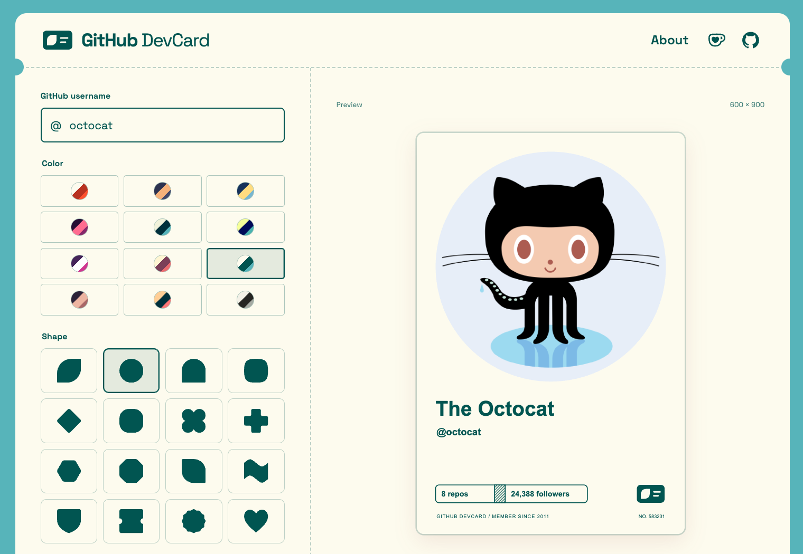

# GitHub DevCard

Create a DevCard from your GitHub profile!



GitHub DevCard is a service that creates a stylish card image from your GitHub profile!

You can generate and download the image from [this site](https://www.nuskey.md/github-devcard/), or paste the Markdown below into your README!

```markdown

```

Replace `YOUR_USERNAME` with your GitHub username. Switch between Portrait (600 × 900) and Landscape (910 × 550, the proportions of a 91 × 55 mm business card) in the site's Layout controls. Your selection is saved locally and applies to SVG/PNG downloads and the generated Markdown.

## About the author

GitHub DevCard is created by [@nuskey8](https://github.com/nuskey8). Consider supporting this project on [GitHub Sponsors](https://github.com/sponsors/nuskey8) or [Ko-fi](https://ko-fi.com/nuskey8)!
